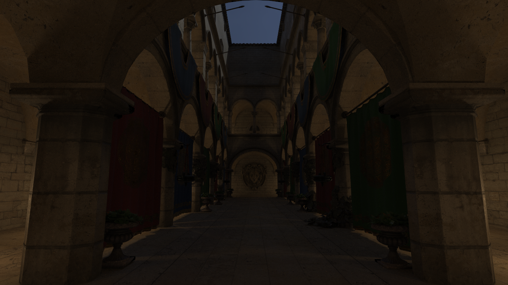
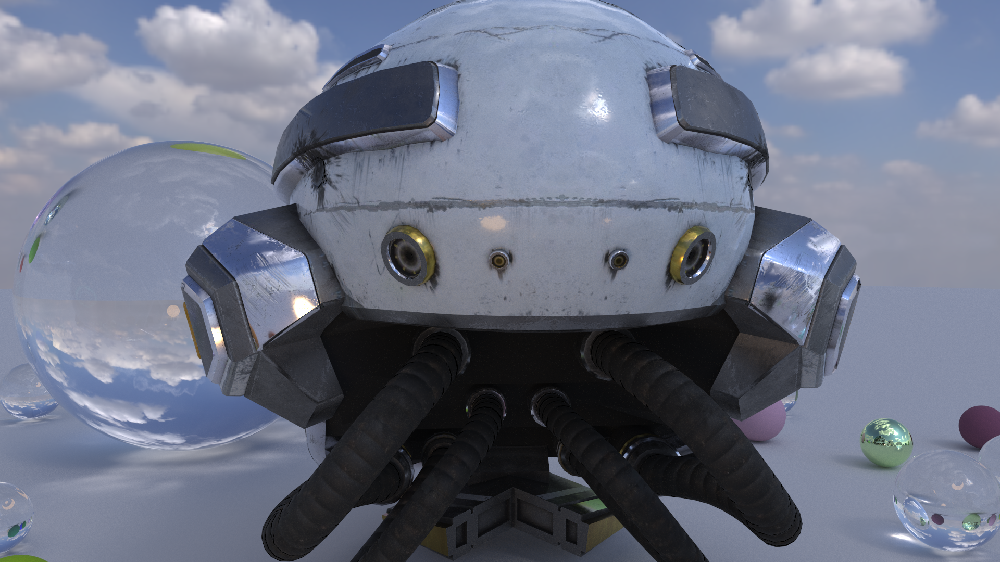
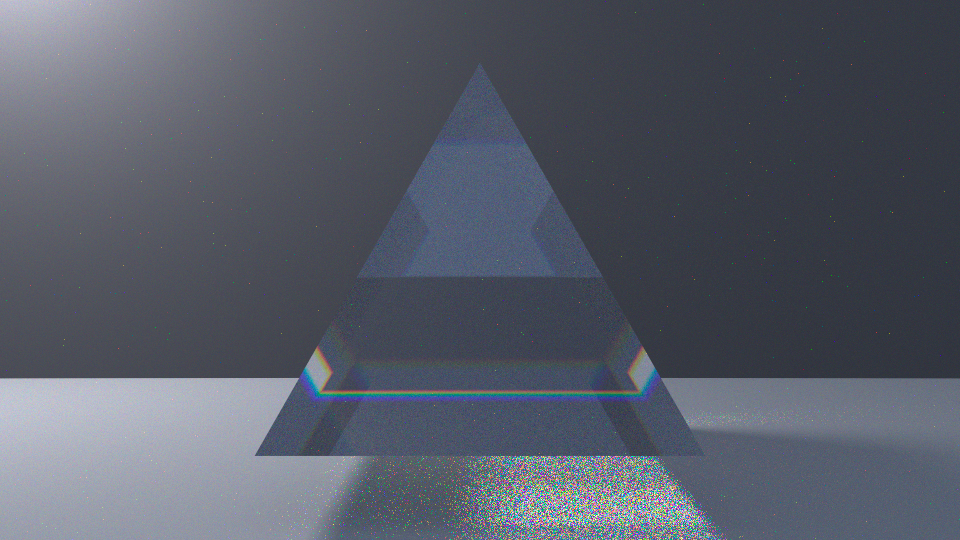
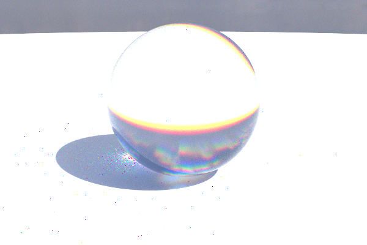

# PathTracer

A physically-based, progressive, unidirectional Monte Carlo **path tracer for macOS / Apple Silicon**, written from scratch in C++20 with **two hand-matched backends** — a CPU reference and a Metal compute kernel — kept *provably* in agreement by a same-seed parity harness. Around the renderer sits a full native editor: live viewer, object picking, gizmos, material and light editing, undo/redo, scene persistence, and adaptive GPU scheduling.

Its headline capability is **ReSTIR DI** (Bitterli et al. 2020): a 36-light scene resolves clean at 512 spp — a scene class that used to stay speckled at 10,000.

> **The real product is the correctness methodology.** Every feature was landed against a brute-force ground truth and gated by a same-seed parity harness that diffs the two backends below the Monte Carlo noise floor. Every bias bug this architecture produced was killed *by measurement, not by assumption*.

---

## Showcase




| Scene | Lights | Samples | Result |
|---|---|---|---|
| Sponza (multi-material) | 36 emissive fixtures | 512 spp | zero fireflies |
| DamagedHelmet | HDRI environment | FINAL (converged) | full PBR, normal-mapped |

---

## What makes it unusual

Most hobby path tracers are one backend, eyeballed for correctness. This one is built the other way around — correctness first, everything else in service of it:

- **Two backends, provably identical.** The entire integrator (RNG, intersection, BSDF, lighting, ReSTIR) is written twice — once in C++ (`integrator.h`), once in Metal Shading Language (`pathtrace.metal`) — and kept in lockstep. Cross products, lerps, bilinear filtering and trig are hand-matched rather than delegated to builtins/hardware samplers, because a single float ULP that flips a branch is enough to break bit-exactness.
- **A same-seed parity harness (`--parity`).** Both backends render the same scene with the same per-`(pixel, pass)` seeds; the results are diffed, with two independent CPU runs providing the Monte Carlo noise floor as a built-in control. Gates are *relative* to that floor. Typical agreement: **~96–99% of pixels bit-exact, mean error hundreds of times below the noise floor.**
- **Brute force as a permanent referee.** A `--brute` toggle renders unbiased ground truth. Every variance-reduction technique — NEE, MIS, importance sampling, all three ReSTIR reuse dimensions — is gated on converging to the *same image* as brute force in the mean. This harness caught real bias bugs (+96%, +10%, +5.7%, +1.3% …), each localized by bisection and fixed with principled math rather than a fudge factor.
- **Determinism as a foundation.** PCG32 seeded per `(pixel, pass)` via splitmix64 → images are bit-identical at any thread count, any GPU work-slicing, any schedule. This is what makes the whole verification culture possible.

**One renderer, three estimators — brute force, NEE+MIS, and full ReSTIR — all provably converging to the same image.**

---

## Features

### Rendering core
- Unidirectional path tracer, iterative bounce loop, max depth 16, Russian roulette after bounce 3 (zero-guarded).
- Progressive accumulation: viewer, PNG export and offline render are all `accum / N` — one math everywhere.
- Metal compute backend, runtime-compiled from embedded source (Command Line Tools only, **no Xcode, no package manager**).
- Adaptive GPU-time budgeting: heavy frames slice into row ranges across ticks (proven byte-identical) so 4K renders never starve the compositor.

### Materials — GGX metallic-roughness BSDF
- glTF-standard parameters (baseColor, metallic, roughness, emission, ior, transmission).
- Cook-Torrance specular: GGX D (cancellation-free form), height-correlated Smith G2, Schlick Fresnel; Fresnel-coupled diffuse.
- VNDF importance sampling (Heitz 2018); delta-dielectric glass.
- Validated by a roughness×metallic grid (`--grid`) and a 20k-sample statistical sampler probe.

### Lighting — unified NEE + MIS over every light type
- HDRI environment (equirectangular `.hdr`), importance-sampled via a luminance×sinθ CDF.
- Emissive spheres (cone/solid-angle sampling) and emissive mesh triangles (area sampling with the r²/cosθ Jacobian).
- Power-heuristic MIS combining BSDF sampling and light sampling across all light types.
- **Sun, sky, lamp, glowing mesh — every light is importance-sampled and MIS-combined**, with brute force one flag away.

### ReSTIR DI (RIS + temporal + spatial)
- RIS: audition 8 candidates per light slot, spend one shadow ray on the winner.
- Temporal reuse: per-pixel persistent reservoirs, M-capped, similarity-gated, visibility re-traced every frame, reset through the central dirty hook.
- Spatial reuse: neighbor reservoir sharing under the Talbot balance heuristic (provably unbiased for arbitrary support overlap).
- All three dimensions unbiased against brute force; toggle with `G`.

### Spectral dispersion (v1.2)
- A `--spectral` mode (also `--prism`, or the Render-tab toggle) where each
  path carries ONE wavelength (400-700nm) instead of an RGB triple; RGB is
  reconstructed at the sensor through the Wyman-Sloan analytic CIE fit ->
  XYZ -> linear sRGB, with a baked round-trip correction so neutral scenes
  reconstruct to the same image (white stays white).
- Glass IOR is wavelength-dependent (Cauchy `n(λ)=A+B/λ²`), so a glass
  sphere disperses white light into a rainbow caustic + colored edge
  fringing — real prism dispersion, tunable from subtle to strong. `B=0`
  reduces exactly to the RGB glass.
- A display-only knob by design's opposite: it changes *tracing*, so it
  resets accumulation (unlike the denoiser). Default OFF -> `--parity`,
  `--brute`, and performance are byte-identical to the RGB pipeline; ON ->
  CPU and GPU still agree same-seed (hand-matched λ sampling + CMF). Uses
  the NEE+MIS estimator; pairs with ReSTIR off.

Mesh materials can be glass too (KHR_materials_transmission / ior on
import, or the generated `--prism-mesh` prism), so the dispersion showcase
is a real triangular prism splitting light into a spectrum:





### Real-time denoiser (v1.1, display-only)
- Edge-aware À-trous / SVGF-style wavelet filter, guided by the G-buffer
  (shading normal, depth, and albedo edge-stops) with albedo demodulation
  so textures and normal-map detail stay crisp while only noisy lighting is
  smoothed.
- **Biased by construction, so isolated by construction:** it runs only as
  a display post-process on a *copy* of the resolved image and never writes
  back into the accumulator. `--parity`, `--brute`, and FINAL/offline export
  remain bit-exact and unbiased — verified identical to pre-feature.
- Adaptive strength: filters hard just after the camera settles, then fades
  to zero as samples accumulate (the pass is skipped entirely at full
  convergence, so the final still image is the true unbiased one). Toggle
  with `N`; iterations, fade-spp, debug AOVs, and a raw-vs-denoised wipe in
  the panel. ~2.7 ms at 960×540 (3 iterations); ~16 MB scratch.

### Geometry & assets
- BVH (midpoint split, median fallback, depth-capped so the traversal stack is a guarantee), built once on host, identical arrays on both backends.
- glTF/GLB via cgltf: full node hierarchy, multi-material meshes via **Metal bindless argument buffers**, JPEG/PNG textures (embedded or file-relative), tangent-space normal mapping.
- Correct sRGB↔linear handling (baseColor/emissive decoded; metallicRoughness/normal left linear; HDRI left linear).

### Native editor
- Bare-AppKit viewer (no GLFW/SDL), CAMetalLayer, resizable to 4K, Retina-crisp Dear ImGui UI.
- Fly camera (WASD/QE + drag-look + sprint), fast-nav raster preview (solid/wireframe) for heavy scenes.
- Picking, ImGuizmo translate/rotate/scale, material & light editors, outliner, undo/redo (Cmd+Z), JSON scene save/load (geometry by reference, bit-exact round-trips).

---

## Build

Requires macOS on Apple Silicon and the Xcode **Command Line Tools** (no full Xcode, no package manager — all dependencies are vendored).

```bash
git clone https://github.com/emzcpp/Path_Tracer.git
cd Path_Tracer
cmake -B build
cmake --build build
```

## Run

```bash
# Interactive viewer with an HDRI environment
./build/pathtracer --env assets/kloofendal_puresky_2k.hdr

# Full ReSTIR (RIS + spatial + temporal); G toggles the estimator live
./build/pathtracer --restir --env assets/kloofendal_puresky_2k.hdr
```

### CLI reference

| Flag | Purpose |
|---|---|
| `./pathtracer` | Interactive viewer (Metal backend) |
| `--cpu` | Run the viewer on the CPU reference backend |
| `--restir` | Enable ReSTIR DI |
| `--brute` | Brute-force ground truth (the referee) |
| `--env <path>` | Load an equirectangular `.hdr` environment |
| `--model <path>` / `--no-model` | Choose / suppress the loaded glTF |
| `--offline [spp]` | Headless render to PNG |
| `--parity [spp]` | **The correctness gate** — diff CPU vs GPU |
| `--grid` | BSDF validation scene (roughness × metallic) |
| `--nan-check` | Scan both accumulators for non-finite values |
| `--gpu-check` / `--mesh-info` | Device / loader & BVH diagnostics |

### In-viewer controls
- **Camera:** `WASD` + `Q/E`, drag to look, `Shift` sprint, scroll to change speed, `F` frames selection.
- **Modes:** `R` FINAL (locks camera, converges, exports PNG). `V` cycles fast-nav (off / solid / wireframe). `G` toggles the ReSTIR estimator. `N` toggles the display denoiser. `U` hides the panel. `?`/`F1` shortcut overlay.
- **Editing:** click to select, `1/2/3` gizmo mode, `Cmd+Z` / `Cmd+Shift+Z` undo/redo. Panel exposes material, light, camera, render settings, and ReSTIR parameters (M / temporal / spatial / M-cap / radius).

---

## Verification

The project's correctness culture, in the commands you can run yourself:

```bash
./build/pathtracer --parity 64      # CPU vs GPU, gated below the noise floor
./build/pathtracer --brute          # unbiased ground truth for any scene
./build/pathtracer --grid           # BSDF energy validation
./build/pathtracer --nan-check      # 0 non-finite across both backends
```

The full methodology — seed discipline, the noise-floor control, gate
definitions, and the bias-bug case studies — is documented in
[docs/PARITY.md](docs/PARITY.md).

Every kernel-touching change is followed by `--parity`. Every variance-reduction technique is gated on matching `--brute` in the mean. Refactors are gated on byte-identical output (checksums). This is why the renderer can carry three different estimators and two different backends and still claim they all produce the *same image*.

---

## Architecture at a glance

```
Camera ray ─▶ BVH intersect ─▶ G-buffer (position, normal, material, RNG state)
                                   │
                                   ▼
              ┌────────── direct lighting ──────────┐
              │  NEE + MIS   or   ReSTIR DI          │
              │  (RIS → temporal reuse → spatial     │
              │   reuse, Talbot balance heuristic)   │
              └──────────────────────────────────────┘
                                   │
                                   ▼
                       indirect bounces (resume path)
                                   │
                                   ▼
                 progressive accumulation  (accum / N)
                                   │
                     ┌─────────────┴─────────────┐
                     ▼                             ▼
              CPU reference                 Metal compute kernel
              (integrator.h)                (pathtrace.metal)
                     └──────── --parity diff ──────┘
```

The integrator is a phased pipeline (`g_primary` → direct → indirect), which is what makes ReSTIR's per-step, all-pixels-synchronized reuse possible while keeping each phase independently sliceable for GPU-time budgeting.

## Dependencies (all vendored — no package manager)

`stb_image`, `stb_image_write`, `nlohmann/json`, `cgltf`, Dear ImGui (+ osx/metal backends), ImGuizmo. Everything else — BVH, loader glue, samplers, BSDF, integrator, ReSTIR, viewer — is written in-repo.

## Acknowledgements

Built on the shoulders of: Shirley, *Ray Tracing in One Weekend*; Heitz 2018 (VNDF sampling); Bitterli et al. 2020 (ReSTIR); the Khronos glTF Sample Assets (DamagedHelmet, Sponza); Poly Haven (CC0 HDRIs).

## License

MIT — see [LICENSE](LICENSE). Bundled assets (the Khronos glTF Sample Assets and Poly Haven HDRI under `assets/` and `Test_Models/`) retain their original licenses; see their source pages.
